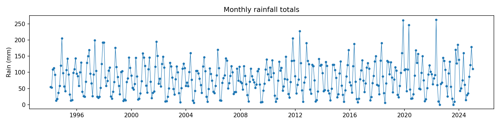
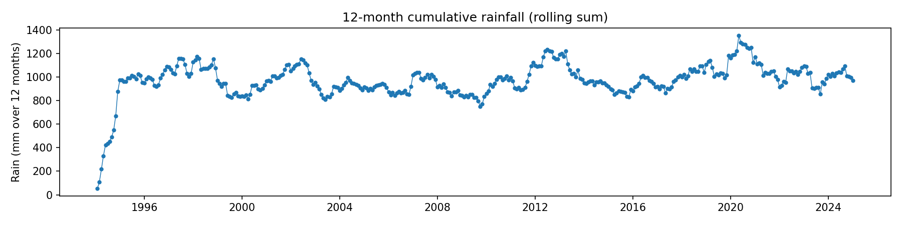
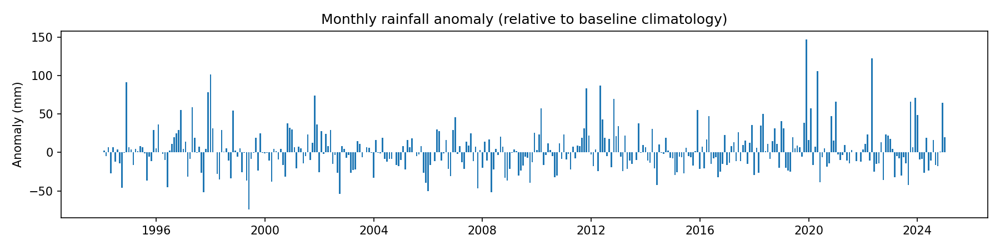
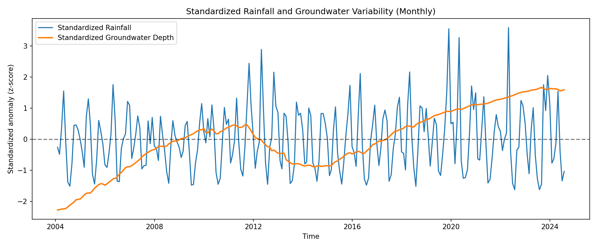
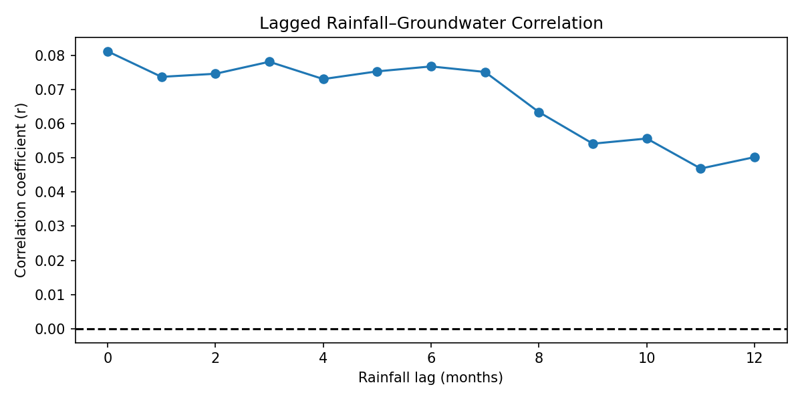
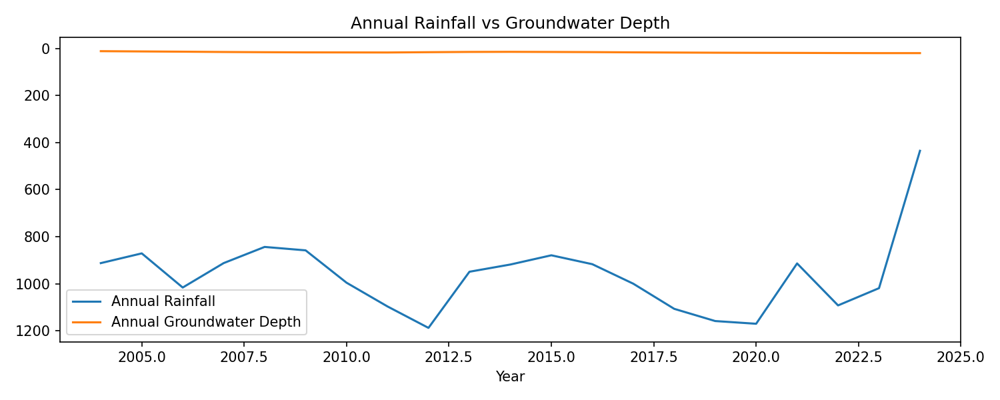

## Interpretation of Results: Rainfall, Groundwater, and Their Linkage

## 1. Rainfall Analysis Interpretation

### 1.1 Long‑term rainfall variability (1994–2024)

The monthly rainfall time series shows pronounced interannual and intra‑annual variability, characteristic of semi‑humid to sub‑humid tropical climates. Periods of sustained above‑average rainfall alternate with multi‑year dry phases, indicating that rainfall is not stationary over time.

The 12‑month rolling cumulative rainfall highlights prolonged wet and dry spells more clearly than individual monthly totals. These multi‑year phases are hydrologically important because groundwater recharge responds primarily to accumulated rainfall rather than to isolated rainfall events.

### 1.2 Seasonal rainfall regime

The monthly boxplots demonstrate a clear seasonal rainfall pattern, with specific months consistently receiving higher rainfall totals. This seasonality defines the potential recharge window for the aquifer system, as effective recharge is most likely during the main rainy seasons when soil moisture deficits are overcome.

### 1.3 Rainfall anomalies

Rainfall anomalies computed relative to the 2004–2014 baseline reveal extended periods of negative anomalies (meteorological droughts) and positive anomalies (wetter‑than‑normal conditions). These anomalies provide a useful framework for comparing rainfall variability directly with groundwater level anomalies.

### 1.4 Rainfall trends

The non‑parametric trend analysis using Kendall’s tau and Sen’s slope indicates that long‑term rainfall trends are weak to moderate. This suggests that rainfall alone may not fully explain long‑term groundwater level changes, highlighting the importance of storage effects and delayed aquifer responses.

Long-term rainfall trends were assessed using non-parametric Kendall’s tau and Sen’s slope applied to annual rainfall totals. The analysis reveals a **weak positive monotonic trend** (τ = 0.11); however, this trend is **not statistically significant** (p = 0.38), indicating that observed variations in annual rainfall are largely driven by interannual variability rather than a systematic long-term change.

Sen’s slope estimates a modest increase of approximately **1.9 mm per year**, but given the lack of statistical significance, this change cannot be interpreted as a robust long-term trend. Overall, rainfall over the study period can be considered **stationary at the annual scale**, with substantial year-to-year fluctuations but no persistent increase or decrease.

The absence of a significant rainfall trend contrasts with the strong and statistically significant trends observed in groundwater levels. This divergence suggests that **long-term groundwater changes are not primarily controlled by changes in rainfall totals**, but rather by delayed recharge processes, groundwater storage dynamics, and potentially anthropogenic influences such as abstraction or land-use change.

---

## 2. Groundwater Analysis Interpretation

### 2.1 Groundwater level dynamics (2004–2024)

The groundwater hydrograph shows clear long‑term variability with superimposed seasonal fluctuations. The inversion of the y‑axis (depth to water) confirms that decreases in depth correspond to rising groundwater levels.

Seasonal oscillations are evident, reflecting periodic recharge during rainy seasons followed by gradual declines during dry periods. This behavior is consistent with an unconfined or semi‑confined aquifer responding to climatic forcing.

### 2.2 Seasonal groundwater cycle

The monthly groundwater climatology reveals a systematic seasonal cycle, with shallow water levels occurring several months after peak rainfall. This lag reflects the time required for rainfall to infiltrate through the soil profile and unsaturated zone before reaching the water table.

### 2.3 Groundwater anomalies

Groundwater anomalies highlight periods of sustained depletion and recovery. Extended negative anomalies indicate long‑term groundwater decline, while positive anomalies correspond to recovery phases following prolonged wet periods. These anomalies integrate the effects of multiple years of rainfall variability.

### 2.4 Groundwater trends

The Mann–Kendall trend test and Sen’s slope analysis indicate a statistically significant long‑term trend in groundwater levels. A positive Sen slope (in m/year) implies a deepening water table (groundwater decline), whereas a negative slope would indicate recovery.

The presence of a significant trend despite relatively weak rainfall trends suggests that groundwater dynamics are influenced by cumulative climatic effects and possibly non‑climatic factors such as abstraction or land‑use change.

Non-parametric trend analysis using Kendall’s tau reveals a **strong and highly significant monotonic trend** in groundwater levels over the study period (τ = 0.69, p < 0.001). The extremely small p-value indicates that the observed trend is not due to random variability and reflects a persistent long-term change in groundwater conditions.

Sen’s slope estimator indicates a **mean groundwater level change of approximately 0.031 m per month**, equivalent to **0.37 m per year**. Given that groundwater depth is measured as depth-to-water, the positive slope implies a **progressive deepening of the water table**, indicating **long-term groundwater decline**.

The magnitude of this trend suggests a substantial cumulative impact over the study period, with implications for groundwater sustainability, well productivity, and dry-season water availability. While short-term fluctuations are influenced by rainfall variability, the strong monotonic trend points to **systematic controls**, potentially including increased abstraction, land-use change, or reduced recharge efficiency.

These results demonstrate that groundwater dynamics cannot be explained by rainfall variability alone, emphasizing the role of aquifer storage, delayed recharge processes, and anthropogenic pressures.

---

## 3. Rainfall–Groundwater Linkage Interpretation

### 3.1 Visual comparison (standardized anomalies)

Standardized (z‑score) rainfall and groundwater time series allow direct comparison despite different physical units (mm vs m). The standardized plots show that major groundwater rises generally follow periods of above‑average rainfall, while groundwater declines correspond to extended rainfall deficits.

However, the relationship is not instantaneous, confirming that groundwater responds to rainfall with a delay.

### 3.2 Correlation analysis (no lag)

The zero‑lag Pearson correlation between monthly rainfall and groundwater depth is weak to moderate, which is expected in groundwater systems. Recharge processes are indirect and delayed, and groundwater levels integrate rainfall over time rather than responding to individual months.

### 3.3 Lagged correlation and recharge delay

The lagged correlation analysis reveals the strongest (most negative) correlation at a lag of several months. This lag represents the dominant recharge response time of the aquifer system.

A lag of approximately 2–6 months is hydrologically realistic and indicates:

- percolation through the soil and unsaturated zone,
- temporary storage in the vadose zone,
- delayed arrival of recharge at the water table.

### 3.4 Annual‑scale comparison

Annual rainfall totals compared with mean annual groundwater depth show a clearer relationship than monthly data. Years with persistently high rainfall are associated with shallower groundwater levels, while drought years correspond to groundwater decline.

This confirms that groundwater variability is controlled primarily by cumulative rainfall at annual to multi‑year time scales rather than short‑term rainfall fluctuations.

---

## 4. Integrated Interpretation and Implications

1. Rainfall exhibits strong variability but weak long‑term trends.
2. Groundwater levels show significant long‑term change, indicating system memory and cumulative effects.
3. The rainfall–groundwater relationship is characterized by delayed recharge rather than instantaneous response.
4. Lagged correlations confirm that groundwater acts as a natural low‑pass filter of climatic variability.

These findings suggest that groundwater resources in the study area are sensitive to prolonged droughts and multi‑year rainfall deficits, even if short‑term rainfall variability appears normal.

---

## 5. Summary Statements

> “Groundwater levels exhibit a delayed but coherent response to rainfall variability, with the strongest correlations occurring at multi‑month lags. This confirms that recharge processes are controlled by cumulative rainfall rather than individual precipitation events.”

> “Despite relatively weak long‑term rainfall trends, groundwater levels show statistically significant change, indicating the presence of system memory and potential additional stresses on the aquifer.”

---
